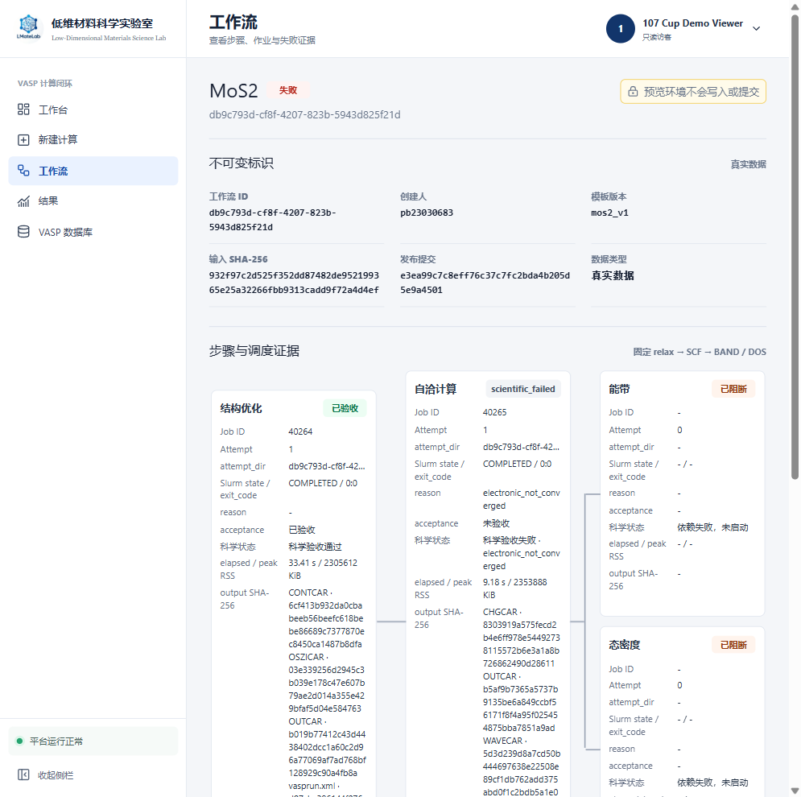

# 107 阶段 7 固定 MoS2 VASP 闭环验收证据

本文记录固定 `MoS2` 模板 `relax -> SCF -> BAND / DOS` 在 107 上的真实 Slurm 与 VASP 验收。范围仅包含阶段 7：不引入 Agent、机器学习、任意材料、任意命令、跨服务器计算或阶段 8 结果解析。

## 1. 当前结论

- 实现修复 PR #40 已合并到受保护 `main`，合并提交为 `e58b769c435da7eaf9c6a9e672a3f4f99ab6401f`。
- 成功工作流 `4b566547-961b-4e10-a8d0-99431f2e2229` 的 Relax、SCF、BAND、DOS 均取得独立真实 Job ID，Slurm 和科学验收全部通过。
- 固定失败工作流 `db9c793d-cf8f-4207-823b-5943d825f21d` 精确停在 SCF `scientific_failed/electronic_not_converged`；BAND/DOS 均为 `blocked`，且没有 attempt、目录或 Job ID。
- 验收同时覆盖 SQLite、工作流目录、Slurm 队列和真实浏览器页面。四层结果一致，没有用页面状态替代数据库或调度证据。
- 阶段 7 满足 `DONE` 门禁。阶段 8 仍为 `PENDING`，本次没有接入 BAND/DOS 结果解析或结果包。

## 2. 修复、构建和稳定服务

生产会话使用 `autoflush=False`。旧 `_next_event_sequence()` 只查询已写入数据库的事件；SCF 科学失败后，同一事务内新建的 BAND、DOS 两个 `workflow_step_blocked` 事件都取得 sequence `16`，触发唯一约束并使终态事务回滚。诊断 Job `40270` 保留的根因是：

```text
UNIQUE constraint failed:
workflow_events.workflow_id, workflow_events.sequence
```

PR #40 令事件编号同时考虑 `session.new` 中同一工作流的待写事件，并把测试会话改为与生产一致的 `autoflush=False`。该 PR 同时将长期 `service.slurm` 固定到 `P107-A100/qos_p107-a100`；VASP runner 继续使用 `P107-RTX5090/qos_p107-rtx5090`。

| 项目 | 证据 |
|---|---|
| 合并提交 | `e58b769c435da7eaf9c6a9e672a3f4f99ab6401f` |
| 构建 Job | `40272`，`P107-RTX5090/anode02`，`COMPLETED/0:0`，耗时 65 秒 |
| 后端 | `440/440`，另 4 项按 107 平台条件跳过 |
| 前端 | `125/125`，Vite 转换 1857 个模块 |
| 发布目录 | `/home/scc/pb23030683/lmatelab-107cup/releases/e58b769c435da7eaf9c6a9e672a3f4f99ab6401f` |
| manifest | 545 项，SHA-256 `0b006c6e0b7dbb1dbcfefcb2da048be704ff532cbddd8332ee7c42a02fe90373` |
| 稳定服务 | Job `40273`，`P107-A100/anode16:18731`，当前 `RUNNING` |
| 被替换服务 | Job `40262`，核对归属后为 `CANCELLED/0:15` |

本地修复分支另通过后端 `440/440`、前端 `125/125`、107cup live 构建、Stage 7/服务 Bash 语法和 `git diff --check`。Windows 本地有 25 项仅因 Windows/POSIX 条件跳过；107 构建仅有 4 项平台跳过。

## 3. 真实成功链

工作流 `4b566547-961b-4e10-a8d0-99431f2e2229` 的四个真实作业为：

| 步骤 | Job | Slurm | 科学状态 |
|---|---:|---|---|
| Relax | `40212` | `COMPLETED/0:0` | 验收通过 |
| SCF | `40250` | `COMPLETED/0:0` | 验收通过 |
| BAND | `40251` | `COMPLETED/0:0` | 验收通过 |
| DOS | `40252` | `COMPLETED/0:0` | 验收通过 |

四步均有独立 attempt 目录、资源耗时、固定输入输出和 SHA-256。前一步验收通过后才提交后续步骤；BAND/DOS 仅在 SCF 通过后形成固定分支。

## 4. 固定失败链

固定失败 profile 为 `scf_nonconvergence_v1`，由创建器 Job `40263` 建立工作流。它不是公共参数，也不能由网页用户改写。

| 步骤 | Attempt | Job | 最终状态 |
|---|---|---:|---|
| Relax | `2f5a7850-e3c3-4ffe-b2ab-fdaacf0562b8` | `40264` | `succeeded`，科学验收通过 |
| SCF | `2f3080ae-b445-4575-975a-e85cccbeafc9` | `40265` | `scientific_failed/electronic_not_converged` |
| BAND | 无 | 无 | `blocked` |
| DOS | 无 | 无 | `blocked` |

短时只读核验 Job `40274` 在 `P107-A100/anode16` 以 `COMPLETED/0:0` 结束，耗时 1 秒。它同时断言：

- `PRAGMA integrity_check=ok`；
- workflow 顶层为 `failed`；
- 四步状态精确为 `succeeded / scientific_failed / blocked / blocked`；
- attempt 表恰有 Relax、SCF 两行，Job ID 恰为 `40264/40265`；
- attempt 根目录恰有上述两个 UUID 目录；
- workflow event sequence 连续且唯一，为 `1-18`；
- 两个 `workflow_step_blocked` 事件分别使用 sequence `16` 和 `17`。

这证明 BAND/DOS 的“未启动”不是页面推断：数据库、目录和 Job ledger 均不存在相应执行记录。

## 5. 网关和访问链

4090 继续只作为可替换网络入口，不保存 107 工作流数据库，也不执行 VASP。

| 项目 | 证据 |
|---|---|
| 107 内部服务 | `anode16:18731` |
| 4090 内部转发 | `127.0.0.1:18740 -> anode16:18731` |
| 公网入口 | `http://222.195.94.37:18733` |
| Windows Operator | `127.0.0.1:21763 -> 4090:18740`，本次切换后 PID `19756` |
| Nginx 当前配置 SHA-256 | `4177ccbbba48599367d1de137609fa71354391f788b9bc2d225ab60501aad498` |
| Nginx 旧配置 SHA-256 | `cb778bfae4e800e715b317d2d100ae2d9ad4c7daa61e3d11374fd6b92b655547` |

候选与活动配置均通过 `nginx -t`，活动配置权限为 `0600`。公网、107 内部转发和 Windows Operator 入口的 live/ready 均返回 Job `40273`、节点 `anode16`、提交 `e58b769...`。验收后旧 `18739 -> anode17:18731` 转发已撤销，旧服务 Job `40262` 已停止，公网和 Operator 入口仍保持新服务。

## 6. 浏览器验收

隔离 Playwright 浏览器使用既有 Demo Viewer 只读身份登录公网入口。Dashboard 显示：

- 总工作流 `2`；
- 运行中 `0`；
- 最近成功 `1`；
- 需关注 `1`。

失败详情页显示 Relax Job `40264` 已验收、SCF Job `40265` 为 `electronic_not_converged`；BAND/DOS 均显示“已阻断”、Attempt `0`、Job ID `-`、attempt_dir `-` 和“依赖失败，未启动”。Viewer 的取消和重试按钮均禁用。



## 7. 原始证据和边界

107 保留：

```text
/home/scc/pb23030683/lmatelab-107cup/logs/build-40272.out
/home/scc/pb23030683/lmatelab-107cup/logs/build-40272.err
/home/scc/pb23030683/lmatelab-107cup/evidence/stage7/terminal-40274.out
/home/scc/pb23030683/lmatelab-107cup/evidence/stage7/terminal-40274.err
```

Windows 外部证据目录为：

```text
D:/Documents/matflow项目/LMateLab-107Cup-evidence/stage7-event-sequence-e58b769
```

| 文件 | SHA-256 |
|---|---|
| `build-40272.out` | `2f4bd749566da48faf62f10aac6aa205f3ecf9e4fd87c865f9396a4b96853e0a` |
| `build-40272.err` | `1e5a10a3705b66d5c64daa546a4444ff3ed789074c988bb772309ec30035b7a6` |
| `terminal-40274.out` | `f79bf77d411fb7ec7480d565d16e2bb0532f84bb3e7b7bda3f6a84efbcf7063b` |
| `terminal-40274.err` | `e3b0c44298fc1c149afbf4c8996fb92427ae41e4649b934ca495991b7852b855` |

`sacct` 在该平台仍无可用记录，短作业 `40272` 已从 `scontrol` 清理。本文使用作业完成时现场保存的 `scontrol` 状态、构建日志、发布 manifest、服务元数据、SQLite/文件系统核验和浏览器结果联合验收，不用单一成功标记替代其他层。

阶段 7 到此结束。后续工作从阶段 8 开始，只接入现有 BAND/DOS 解析与可追溯结果包；不得回填 Agent、机器学习、任意材料或任意命令功能。
